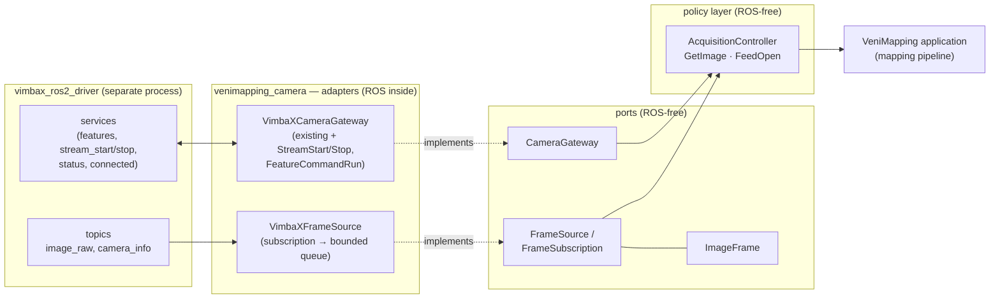
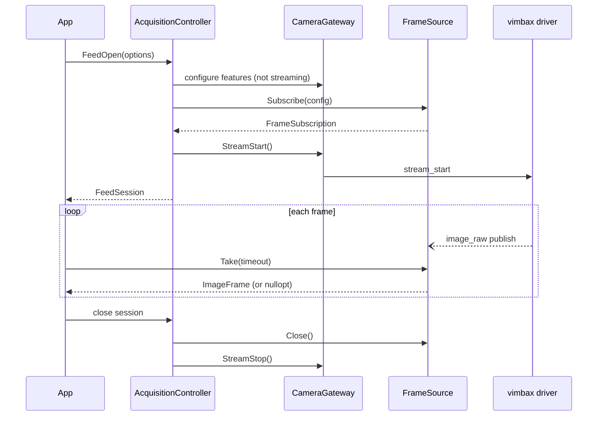

# Image Acquisition Architecture: Get Image and Image Feed

**Status:** Proposed (design only — no implementation in this document's branch)
**Scope:** `venimapping_camera`, `venimapping_bringup`
**Author:** Logan Kaising (design study prepared with Claude Code)

---

## 1. Purpose and scope

VeniMapping needs two acquisition capabilities on top of the existing camera
gateway:

1. **Get image** — acquire a single image on demand: "give me one frame, now,
   with a bounded wait and a defined freshness meaning."
2. **Get image feed** — consume a continuous stream of frames with explicit,
   observable backpressure: "deliver frames as they arrive; when I fall
   behind, drop predictably and tell me."

This document defines the long-term architecture for both: the domain types,
the port contracts, the concrete adapter over `vimbax_ros2_driver`, the
threading and memory model, the error vocabulary, the testing strategy, and a
phased implementation roadmap. It is a design document; it deliberately
contains no production code. Interface sketches in the appendix are
illustrative, not normative.

**Interpretation note.** "Get image" here means *camera acquisition*, not
retrieval of stored assets. The repository contains no storage or serving
layer; the natural reading — and the one this document architects — is
acquiring frames from the Allied Vision camera behind the Vimba X driver.

---

## 2. What exists today

The workspace has a deliberately thin, layered camera stack:

| Piece | Role | State |
|---|---|---|
| `CameraGateway` (`camera_gateway.hpp`) | ROS-independent contract: feature get/set/info (float, enum), access modes, feature list, camera status, connection status | Implemented |
| `VimbaXCameraGateway` | Concrete gateway over `vimbax_ros2_driver` *services*; hides service names, timeouts, rclcpp exceptions; synchronous calls bound to one worker thread | Implemented |
| `Expected<T>` / `Error` (`expected.hpp`) | `std::expected`-based result vocabulary; `driver` errors verbatim, `gateway` diagnostics non-contractual | Implemented |
| `camera_gateway_probe` | Disposable integration probe against a live camera | Implemented (temporary by design) |
| `venimapping_bringup` | Launches the driver under the stable namespace `/vimbax_camera`, `autostream` defaulted to `0` | Implemented |
| **Image acquisition** | Getting pixels out of the camera into VeniMapping | **Absent — this document** |

Two properties of the existing design shape everything below:

- The gateway is a **control plane**: request/response, seconds-scale
  timeouts, one blocking call at a time on a bound worker thread.
- The gateway is **primitives, not policy** (its own header says so):
  clamping, fallback, retry, and configuration ordering are explicitly
  deferred to "future layers." Image acquisition is the first feature that
  forces one of those future layers into existence.

---

## 3. The upstream contract we build on

These facts were extracted from the `vimbax_ros2_driver` source (v1.0.1, the
version targeted by `scripts/env.sh`; ROS 2 Jazzy; tested by Allied Vision
with CycloneDDS, which our environment also selects). They are the wire
contract the design must respect. File references are into the driver
repository.

### 3.1 Image publishing (the data plane the driver offers)

- Images are published with `image_transport::CameraPublisher` on
  **`<ns>/image_raw`** (`sensor_msgs/msg/Image`) with a paired
  **`<ns>/camera_info`** (`sensor_msgs/msg/CameraInfo`) sharing the same
  header (`vimbax_camera_node.cpp:350-364`).
- Publisher QoS is **hardcoded**: RELIABLE, KEEP_LAST(10), VOLATILE. It is
  *not* the best-effort "sensor data" profile most camera drivers use, and no
  parameter changes it. A RELIABLE publisher is compatible with both RELIABLE
  and BEST_EFFORT subscribers, so the subscriber side chooses the trade-off.
- There is **no snapshot service**. The only way the driver hands out pixels
  is the topic. "Get image" therefore must be built *from the stream*, one
  way or another.

### 3.2 Stream lifecycle

- Explicit control: **`<ns>/stream_start`** and **`<ns>/stream_stop`**
  (`vimbax_camera_msgs/srv/StreamStartStop`: empty request, `Error` reply).
  Starting an already-active stream returns success and does nothing;
  start/stop racing a transition in progress returns `VmbErrorInvalidCall`
  (-15); an unavailable camera returns `VmbErrorNotFound` (-3); an
  unsupported `PixelFormat` fails the start with `VmbErrorNotSupported`
  (-18) (`vimbax_camera.cpp:409-521`).
- Automatic control: with the **`autostream=1` driver default**, a polling
  thread starts streaming when the image topic's subscriber count rises and
  stops it when the count reaches zero (`vimbax_camera_node.cpp:579-628`).
  Two hazards make autostream unsuitable for deterministic acquisition:
  - A guard bug (`node.cpp:604`: a condition that is always true inside its
    enclosing branch) means an explicit `stream_stop` is silently undone the
    moment *any* new subscriber appears.
  - The subscriber count includes `camera_info` subscribers and any
    debugging tool (`rqt`, `ros2 topic echo`), so unrelated observers start
    the camera.

  Our bringup already sets `autostream:=0`. **The architecture standardizes
  on `autostream:=0`: streaming is started and stopped explicitly through
  the gateway, never as a side effect of subscription.** Subscribing and
  streaming become orthogonal, which the policy layer (§8) relies on.

### 3.3 Single-shot and trigger support

- The driver exposes **`<ns>/features/command_run`**
  (`FeatureCommandRun.srv`), which can execute the GenICam `TriggerSoftware`
  command — the building block for precise single-frame capture.
- Constraint: the driver's implementation sleeps **100 ms unconditionally**
  per command call before checking completion (`vimbax_camera.cpp:652-691`),
  so any software-triggered path is capped below 10 Hz and a single
  triggered capture costs ≥100 ms. Per-frame software triggering at rate is
  therefore off the table; the feed uses free-run streaming, and software
  trigger is reserved for deliberate single captures.
- Related trap: the driver's `command_feature_timeout` parameter must stay
  `0` (→ 1 s default) or be set >200 ms; values ≤100 ms make every command
  report `VmbErrorTimeout` even when it succeeded.

### 3.4 Timestamps, frame identity, and loss visibility

- `header.stamp` provenance is controlled by the driver's `use_ros_time`
  parameter. The **default (`false`) stamps frames with the camera's
  internal clock**, whose epoch is typically camera power-on — incomparable
  with node clocks, `tf2`, bag replay, or any freshness check. With
  `use_ros_time:=true` the stamp is the driver node's clock sampled in its
  frame worker (≈ receive time, after any pixel transform). **Bringup shall
  set `use_ros_time:=true`** (§10); the design additionally avoids relying
  on cross-process clock comparison for correctness (§8.2).
- `header.frame_id` comes from the read-only `camera_frame_id` parameter
  (default `vimbax_camera_<DeviceID>`).
- **No frame counter reaches the wire.** The SDK's `frameID` is used only
  for a driver-side log line; incomplete frames are silently requeued
  without publishing. Consumer-side transport loss *is* observable through
  the RMW `message_lost` subscription event, which the adapter must wire up
  and count (§6.4).
- 10/12/14-bit pixel formats are published MSB-aligned inside 16-bit
  encodings (values scaled ×64/×16/×4), with nothing in the message saying
  so. The feed carries encodings verbatim (§6.2); interpreting them is a
  downstream concern, and bringup pins a known-good `PixelFormat` from the
  driver's supported gate list (Mono8/12/16, Bayer 8/10/12/16 variants,
  Rgb8, Bgr8, YUV422 variants).

### 3.5 Calibration

- The driver publishes `camera_info` via `camera_info_manager`, loading from
  the read-only `camera_info_url` parameter. If the loaded calibration's
  resolution mismatches the live frame (ROI/binning change), it silently
  publishes a **blank** `CameraInfo` (all-zero `K`); consumers must treat
  `K[0] == 0` as "no calibration." Calibration handling is deliberately out
  of the feed's Phase 1 scope but has a designed extension point (§13).

### 3.6 Connection and events

- Camera connect/disconnect is **not** exposed as an event; the only signal
  is polling the `connected` service, which the existing
  `ConnectionStatusGet()` already wraps. Feed silence + `ConnectionStatusGet`
  is therefore the designed disconnect-detection pattern (§8.4).
- GenICam camera events (e.g. `ExposureEnd`) exist behind a
  subscribe-service + per-event-topic protocol with a 500 ms zero-subscriber
  reaper race. They are not needed for either feature here and stay out of
  scope; the risk register notes them as a future option (§14).

---

## 4. Design principles carried forward

The new surface extends the codebase's established philosophy; every design
decision below traces to one of these.

1. **Ports are ROS-free.** No ROS type appears in any contract header. The
   adapter is the only place `sensor_msgs`/`rclcpp` exist.
2. **Adapters hide the wire.** Topic names, QoS, subscription mechanics, and
   driver quirks are adapter implementation detail.
3. **Primitives, not policy.** The gateway and frame source report what
   happened; deciding what to do (start streams, configure triggers, retry,
   restore state) belongs to the new policy layer, which is the *first* of
   the "future layers" the gateway header promised.
4. **Verbatim errors, two domains.** Driver errors pass through untranslated;
   gateway diagnostics remain non-contractual. No new error domains.
5. **Explicit thread contracts, misuse detection over synchronization.** The
   one internally synchronized object is the frame queue, whose entire
   purpose is to be the boundary between the driver's push and the
   consumer's pull.
6. **Absence of data is an answer, not an error.** `ConnectionStatusGet`
   returns `false` as a successful negative; the feed's `Take` returns an
   empty optional on timeout the same way.
7. **Factories return `Expected`, adapters are pinned** (non-copyable,
   non-movable), `[[nodiscard]]` throughout, C++23.
8. **Disposable probes** validate against real hardware; unit tests validate
   logic against fakes.

---

## 5. Architecture overview

The design splits acquisition into a **control plane** (the existing gateway,
grown by three service-backed primitives) and a new **data plane** (a frame
source port delivering frames by pull), composed by a new **policy layer**
that implements the two user-facing features.



Why two ports instead of growing `CameraGateway` into an everything
interface:

| | Control plane (`CameraGateway`) | Data plane (`FrameSource`) |
|---|---|---|
| Shape | 1 request → 1 response | 1 subscription → unbounded frames |
| Timing | seconds-scale timeouts | milliseconds-scale, high rate |
| Threading | blocking call on bound worker | driver pushes, consumer pulls |
| Failure mode | timeout / driver error per call | silence, drops, staleness |
| Lifecycle | per call | subscription duration |

Forcing both shapes through one interface would compromise both contracts —
in particular the gateway's carefully documented "synchronous, bound worker
thread" model cannot describe an asynchronous frame push. Interface
segregation also means the mapping pipeline can depend on `FrameSource`
alone, and tests can fake each side independently. The stream-control and
trigger primitives, however, **are** request/response services, so they join
`CameraGateway`, reusing its `Call`/`CallChecked` machinery, timeout
handling, and thread contract unchanged.

---

## 6. Data plane design

### 6.1 `ImageFrame` — the domain frame type

A ROS-free value type carrying:

| Field | Meaning |
|---|---|
| `width`, `height` | pixel dimensions, verbatim from the wire |
| `step` | bytes per row, verbatim (driver computes it at stream start; see §14 ROI caveat) |
| `encoding` | the wire encoding string, verbatim (`"mono8"`, `"bayer_rggb16"`, …); never translated or interpreted here |
| `stamp_ns` | `header.stamp` as a single signed nanosecond count; provenance documented as configured by bringup (`use_ros_time:=true` ⇒ driver receive time) |
| `frame_id` | `header.frame_id` verbatim |
| `receive_seq` | adapter-assigned, monotonically increasing per subscription, starting at 0 — the *only* frame identity the wire supports (§3.4) |
| `data()` | `std::span<const std::byte>` view of the pixel buffer |

**Memory model — zero copy by construction.** The adapter receives
`sensor_msgs::msg::Image::ConstSharedPtr` from rclcpp and must not copy the
pixel payload (2-15 MB per frame at rate would burn hundreds of MB/s of
memcpy). `ImageFrame` therefore holds a **type-erased keepalive**
(`std::shared_ptr<const void>` aliasing the received message) plus plain
metadata fields and a span into the kept-alive buffer. Consequences, stated
as contract:

- `ImageFrame` is cheaply copyable; copies share the buffer.
- Holding an `ImageFrame` pins one received message buffer (heap memory
  deserialized by the RMW — not a DDS-internal loan, so holding it is safe
  indefinitely and costs only memory).
- Worst-case pinned memory is bounded and computable:
  `(queue_capacity + frames held by the consumer) × frame size`.
- No ROS header is included anywhere in `image_frame.hpp`; the keepalive's
  static type never escapes the adapter.

*Rejected alternative — copy into an owned buffer:* simpler ownership story,
but adds a guaranteed full-frame copy per frame on the hot path, precisely
the cost the rest of the pipeline is designed to avoid. Rejected.

### 6.2 Verbatim encoding, downstream interpretation

Consistent with the gateway's verbatim-error philosophy, the frame's
`encoding` string is passed through untranslated, and the feed performs **no
pixel work**: no debayering, no bit-depth normalization (the driver's
MSB-alignment of 10/12/14-bit data included), no color conversion. A future
`pixel_format` module may interpret encodings for the mapping pipeline;
bringup keeps the problem small by pinning `PixelFormat` to a format the
pipeline consumes directly (§10).

### 6.3 `FrameSource` / `FrameSubscription` — the port

```
FrameSource::Subscribe(FeedConfig) -> Expected<unique_ptr<FrameSubscription>>
FrameSubscription::Take(timeout)   -> Expected<optional<ImageFrame>>
FrameSubscription::TryTake()       -> Expected<optional<ImageFrame>>
FrameSubscription::StatsGet()      -> FeedStats
FrameSubscription::Close()         -> void   (idempotent, any thread)
```

- **Pull, not callbacks.** Consumers call `Take(timeout)`; the adapter never
  runs consumer code on its own (executor) threads. Rationale: a consumer
  callback on the executor thread could call back into the gateway and
  deadlock exactly the way the gateway's header already warns about;
  callbacks make backpressure implicit in DDS internals; and pull keeps the
  consumer's threading identical to the established bound-worker discipline.
  A consumer that wants push can trivially wrap `Take` in its own loop
  thread; the reverse (unwrapping callbacks into pull) requires exactly the
  queue this design already builds.
- **`Take` result shape.** `nullopt` means "no frame within the timeout" — a
  successful negative answer (the `ConnectionStatusGet() == false`
  precedent), normal during stream startup, low frame rates, or triggered
  operation. An *error* means the feed is closed or the call violated the
  contract. Callers can loop on `nullopt` without inspecting non-contractual
  diagnostic codes.
- **Subscription ≠ streaming.** With `autostream:=0`, subscribing arms
  delivery but does not start the camera; `CameraGateway::StreamStart()`
  does. The policy layer owns the ordering (§8). The port documents this
  explicitly so no future adapter reintroduces hidden coupling.
- **Threading contract.** `Subscribe` follows the gateway's bound-thread
  rules (it is a control action). Each subscription has a single-consumer
  contract for `Take`/`TryTake` (recorded on first use, debug-asserted,
  reported as a gateway-domain error where assertions are disabled —
  mirroring `BindToCurrentThread`'s misuse-detection-not-synchronization
  stance). `Close()` is the deliberate exception: idempotent and callable
  from any thread so a supervisor can unblock a consumer stuck in `Take`;
  destruction implies `Close` but must not race a call in progress (the
  single-consumer rule already guarantees that for the consumer side).

### 6.4 Bounded queue and backpressure

Between the rclcpp subscription callback and `Take` sits the design's one
internally synchronized component: a bounded FIFO of `ImageFrame`s
(mutex + condition variable; entries are shared-pointer-sized, so lock hold
times are nanoseconds-scale).

- **Capacity is set at `Subscribe` time** (`FeedConfig::queue_capacity ≥ 1`).
- **Overflow policy: drop-oldest, count the drop.** For a live-perception
  feed, the newest frame is worth more than the oldest; drop-oldest bounds
  both memory and staleness. **`queue_capacity = 1` is latest-frame-only
  mode** — the "sample the current image" use case falls out of the same
  mechanism instead of needing a separate API.
- **Loss is observable, never silent.** `FeedStats` carries monotonic
  counters, all queryable from the consumer thread:
  - `frames_received` — delivered into the queue;
  - `frames_dropped_overflow` — evicted by capacity;
  - `frames_lost_transport` — RMW `message_lost` events on the subscription
    (the only visibility into DDS-level loss the platform offers, §3.4).
- **Subscriber QoS** defaults to RELIABLE / KEEP_LAST(small) to match the
  publisher's offer (§3.1) — on-host, this makes overflow policy live in
  *our* queue where it is counted, rather than in DDS where it is not.
  `FeedConfig` exposes reliability (and rmw history depth) because a future
  network-split deployment may prefer BEST_EFFORT; the port stays neutral,
  the default follows the measured platform.

### 6.5 Adapter: `VimbaXFrameSource`

Construction mirrors `VimbaXCameraGateway::Create` (node reference, camera
namespace, `Expected` factory; the topic name is derived the same way service
names are). Internals per subscription: one `rclcpp` subscription whose
callback assigns `receive_seq`, wraps the message into an `ImageFrame`
(keepalive alias, no copy), pushes with drop-oldest, and notifies; a
`message_lost` event callback increments the transport-loss counter. The
executor arrangement is unchanged from today: the application spins a
`SingleThreadedExecutor` on its own thread (as the probe does), so
subscription callbacks never share the consumer's thread.

---

## 7. Control plane extensions to `CameraGateway`

Three additions, all thin wrappers over existing driver services, all reusing
the gateway's current machinery and thread contract:

| New method | Driver service | Contract notes |
|---|---|---|
| `StreamStart()` | `stream_start` | Success when already streaming is a driver-defined no-op and is passed through as success. `VmbErrorNotSupported` (-18) surfaces bad `PixelFormat` at start — with explicit control this failure is *visible*, unlike under autostream where the driver swallows it (§3.2). |
| `StreamStop()` | `stream_stop` | Symmetric no-op semantics. |
| `FeatureCommandRun(name)` | `features/command_run` | Synchronous: the driver completes the command (or its 1 s internal default expires) before replying; the ≥100 ms floor (§3.3) is documented on the method. The gateway's per-call timeout must therefore comfortably exceed 100 ms + command duration. |

Also recorded here for roadmap honesty (not needed by these two features, so
not added yet): the driver offers int/bool/string/raw feature services and
`settings/{load,save}` that the gateway does not wrap. The policy layer's
configuration work (§8.3) will need **`FeatureIntGet/Set`** and
**`FeatureBoolGet/Set`** at minimum (e.g. `Width`, `Height`,
`AcquisitionFrameRateEnable`); they follow the exact existing pattern and
should be added when first needed, not speculatively.

`CameraStatusGet().streaming` remains the streaming-state readback (the
driver reports "active or starting" there), which the policy layer uses for
save/restore.

---

## 8. Policy layer: `AcquisitionController`

The first "future layer" the gateway header promised. It composes the two
ports — it depends on `CameraGateway&` and `FrameSource&`, never on ROS — and
owns *all* sequencing, freshness, and state-restoration policy. It runs on
the same single worker thread that owns the gateway (one owner, no new
concurrency).

### 8.1 Feature: get image feed — `FeedOpen`

```
AcquisitionController::FeedOpen(FeedOptions) -> Expected<FeedSession>
```

Sequencing (the reason this is policy, not adapter behavior):

1. Verify/apply acquisition-critical configuration while **not** streaming
   (`PixelFormat` in the driver's supported gate list, frame rate, §8.3) —
   feature access modes change while streaming, which is why bringup chose
   `autostream:=0` from the start.
2. `FrameSource::Subscribe(...)` — arm delivery first so no startup frames
   race past an unarmed subscriber.
3. `CameraGateway::StreamStart()`.
4. Hand the `FrameSubscription` to the consumer inside a `FeedSession` RAII
   object whose close path is `Close()` → `StreamStop()` (restoring the
   camera to idle; policy decides whether stopping is conditional on having
   been the one to start).



### 8.2 Feature: get image — `GetImage`

```
AcquisitionController::GetImage(GetImageOptions) -> Expected<ImageFrame>
```

Two strategies, selected per call, because they answer different questions:

**S1 — sample from the stream (default; cheap).** Answers "what does the
camera see about now?"

- If a feed is already open: drain the queue, then `Take` the next arriving
  frame — freshness is defined as *received after the request*, a definition
  that works even across imperfect clock domains. When stamps are
  ROS-time-comparable (bringup guarantees this, §10), an optional stamp
  floor tightens it.
- If idle: `Subscribe(capacity=1)` → `StreamStart()` → take the first frame
  → `StreamStop()` and unsubscribe (restore idle). First-frame latency
  includes stream spin-up; the probe will measure it (§12).

**S2 — software-triggered single exposure (precise; ≥100 ms).** Answers
"expose one frame *now* and give me that exact frame" — the semantics a
mapping measurement wants when correlating with external state.

1. Save current trigger configuration (`TriggerSelector`, `TriggerMode`,
   `TriggerSource` via existing enum primitives).
2. Configure: `TriggerSelector=FrameStart`, `TriggerMode=On`,
   `TriggerSource=Software` — while not streaming, since GenICam cameras
   lock transport/acquisition parameters during active acquisition; the
   gateway's existing `FeatureAccessModeGet` is the runtime guard.
3. `Subscribe` → `StreamStart()` (camera now waits, exposing nothing).
4. `FeatureCommandRun("TriggerSoftware")` → exactly one exposure; `Take` it.
5. Restore trigger configuration and prior streaming state (the probe's
   save/restore discipline — "leaving the camera modified is the one result
   the write path must not produce" — is the model).

The two strategies bracket the design space: S1 is milliseconds when a feed
is warm; S2 buys exposure-after-request semantics for ≥100 ms + exposure
time and never exceeds ~10 Hz (§3.3). Anything faster with trigger-grade
precision is hardware-trigger territory — out of scope, noted in §14.

### 8.3 Configuration ordering (owned here, nowhere else)

The rule the driver imposes and this layer enforces: **shape-changing
features (`PixelFormat`, `Width`, `Height`, binning) only while not
streaming**; the stream must be restarted after any of them (the driver
computes `step` once at stream start, §14). Frame rate
(`AcquisitionFrameRate` via the float primitives) is the tuning knob the
feed exposes first. The controller verifies effective values by readback,
because the gateway contract explicitly does not.

### 8.4 Disconnect and silence

A feed that goes silent is indistinguishable, from the queue alone, from a
paused camera. Policy: on `Take` timeout, the controller (or the consumer's
supervisor loop) consults `ConnectionStatusGet()` — the platform's only
disconnect signal (§3.6) — and decides between waiting, restarting the
stream (the driver auto-reopens on reconnect but does not restart our
stream), or surfacing the outage. The ports stay mechanism; the timeout
budget and retry policy stay here.

---

## 9. Error vocabulary extension

No new domains; no taxonomy. Driver errors keep flowing verbatim
(`stream_start`'s -15/-3/-18 among them). New **non-contractual** gateway
diagnostics for the data plane, extending `detail::GatewayDiagnostic`:

| Diagnostic | Produced when |
|---|---|
| `kSubscriptionFailed` | rclcpp subscription creation threw in `Subscribe` |
| `kFeedClosed` | `Take`/`TryTake` after `Close()` (or source destruction) |
| `kFeedThreadContractViolation` | consumer-thread misuse (mirrors existing №5) |

Deliberate non-errors, per principle 6: `Take` timeout (`nullopt`), queue
overflow (a counted, expected consequence of the chosen capacity), and
transport loss (counted). Errors are for *broken machinery*, not for the
normal physics of a lossy, timed data plane.

---

## 10. Bring-up implications (`venimapping_bringup`)

The launch file grows the following pinned, documented choices:

| Parameter | Value | Why |
|---|---|---|
| `autostream` | `0` (already) | Deterministic, explicit stream control (§3.2) |
| `use_ros_time` | `true` | Comparable stamps; default device-clock stamps break freshness, tf2, bags (§3.4) |
| `PixelFormat` (via settings or controller config) | pinned to a gate-list format the pipeline consumes | Unsupported formats fail stream start; MSB-alignment surprises avoided by choosing 8-bit first (§3.4) |
| `camera_info_url` | project calibration file, when calibration lands | Blank-`K` fallback otherwise (§3.5) |
| `buffer_count` | default 7, revisit with measurements | Changeable only while not streaming |
| DDS tuning | CycloneDDS socket-buffer sizing per driver README | RELIABLE full-rate images on localhost |

`command_feature_timeout` stays at its default (§3.3).

---

## 11. Alternatives considered

| Alternative | Verdict | Reason |
|---|---|---|
| Grow `CameraGateway` with image methods (one interface) | **Rejected** | Incompatible call shapes and thread contracts; §5 table. |
| Callback-based feed API | **Rejected** | Runs consumer code on executor threads (documented deadlock hazard), hides backpressure; pull composes into push trivially, not vice versa. |
| Copy frames into owned buffers | **Rejected** | Guaranteed full-frame memcpy per frame on the hot path; §6.1. |
| Rely on autostream (subscribe-to-start) | **Rejected** | Driver bug defeats explicit stops; `camera_info`/debug subscribers start the camera; failures at start are swallowed; §3.2. |
| `image_transport` subscriber in the adapter | **Rejected (for now)** | The in-process pipeline wants raw frames; plain rclcpp on `image_raw` avoids a dependency and plugin surface. Compressed transports remain available to *other* tools directly from the driver. |
| Expose a ROS "get image" service to other nodes | **Deferred** | No current external consumer; when one appears, a thin node wraps `AcquisitionController::GetImage` without changing the ports. |
| Bypass the driver: direct VmbCPP/VmbC `FrameSource` adapter | **Deferred — the designed escape hatch** | Would eliminate the driver's copy + DDS hop (§3.4 driver-side copies, serialization) and expose SDK `frameID` and true device timestamps. Costs: owning acquisition-engine complexity the driver currently owns, a second SDK integration to maintain. The `FrameSource` port is *exactly* the seam that makes this a swap-in later; Phase B's measurements (§12) provide the trigger criteria (sustained CPU/latency/drop budgets violated at required resolution/rate). |
| Recording/rosbag support in the feed | **Out of scope** | `ros2 bag record <ns>/image_raw` consumes the driver topic directly; needs nothing from this design (but note: with `autostream:=0`, something must be streaming — a bag session uses `FeedOpen` or the bare `StreamStart`). |

---

## 12. Testing strategy

Following the codebase's two-tier pattern (unit logic against fakes;
disposable probes against hardware):

**Unit (no ROS, no camera):**
- `detail/frame_queue`: capacity-1 and capacity-N drop-oldest behavior,
  counters, `Take` wakeup ordering, `Close` unblocking a pending `Take`,
  close-idempotence, single-consumer misuse detection. This component is
  deliberately ROS-free so it tests in milliseconds.
- `ImageFrame`: keepalive lifetime (buffer outlives source message handle),
  copy sharing, span integrity.
- `AcquisitionController` against `FakeCameraGateway` + `FakeFrameSource`:
  S1/S2 sequencing (configure-before-start ordering, trigger save/restore on
  success *and* on every failure path), freshness drain logic, disconnect
  policy, feed open/close restoring stream state. These fakes are the first
  reuse of the ports' testability and should live under the package's test
  tree as reusable fixtures.

**Integration (probe, temporary by design, replacing nothing):**
- `camera_feed_probe`, sibling of `camera_gateway_probe`: opens a feed,
  consumes N seconds, reports measured rate vs `AcquisitionFrameRate`,
  overflow/transport-loss counters, end-to-end latency distribution
  (`now - stamp_ns`, valid because bringup pins `use_ros_time:=true`),
  first-frame latency after `StreamStart`, and clean-shutdown behavior
  (`Close` during a blocked `Take`). Then exercises `GetImage` both
  strategies, verifying S2 restored trigger configuration afterward
  (readback, probe-style).
- The probe's numbers are not vanity metrics: they are the **decision inputs
  for §11's direct-SDK escape hatch** and for default `queue_capacity` /
  `buffer_count` values.

---

## 13. Phased roadmap

Each phase lands independently useful, reviewable work; no phase depends on a
later one.

| Phase | Contents | Acceptance |
|---|---|---|
| **A — control-plane parity** | `StreamStart`/`StreamStop`/`FeatureCommandRun` on the port + vimbax adapter; probe checks (start→status.streaming→stop cycle, double-start no-op) | Probe passes against hardware; no-op and error passthrough semantics verified |
| **B — data plane** | `ImageFrame`, `FrameSource`/`FrameSubscription` ports, `detail/frame_queue` + unit tests, `VimbaXFrameSource`, `camera_feed_probe` | Unit suite green without hardware; probe sustains configured rate with zero overflow at chosen capacity, counters accurate, clean shutdown; latency/CPU numbers recorded in the doc |
| **C — policy layer** | `AcquisitionController` (`FeedOpen`/`FeedSession`, `GetImage` S1+S2), gateway parity additions it needs (`FeatureInt*`, `FeatureBool*`), fakes + unit tests, probe extension | Fake-based tests cover both strategies' success and restore-on-failure paths; probe demonstrates S1 warm/cold and S2 with config restore verified by readback |
| **D — bringup & decision review** | Launch updates per §10, DDS tuning notes, calibration extension point (`camera_info` pairing design if mapping needs per-frame intrinsics), review Phase B numbers against budgets → go/no-go on direct-SDK adapter investigation | Bringup reproducible from clean checkout; decision recorded with data |

Extension points explicitly kept open (designed, not built): per-frame
`CameraInfo` pairing (same-stamp contract, blank-`K` guard), multi-camera
(all ports are instance-per-camera already; a session layer composes),
hardware trigger (replaces S2's `TriggerSource=Software` with a line source;
same save/restore skeleton), direct-SDK `FrameSource` adapter (§11).

---

## 14. Risks and open questions

| # | Risk | Mitigation |
|---|---|---|
| 1 | RELIABLE, non-configurable publisher QoS at full rate causes DDS pressure on constrained hardware | Phase B measurements; CycloneDDS tuning (§10); BEST_EFFORT subscriber knob exists in `FeedConfig`; escape hatch §11 |
| 2 | Driver-side frame gaps are invisible on the wire (incomplete frames silently requeued) | Accepted for now: `receive_seq` + transport-loss counter cover consumer-side loss; driver logs cover its side; device-timestamp deltas could be added to stats later |
| 3 | Mid-stream ROI/binning change makes `step` stale (driver computes once at start) | Policy layer forbids shape changes while streaming (§8.3); restart stream after reconfiguration |
| 4 | `use_ros_time:=true` sacrifices exposure-accurate device timestamps that a future SLAM stage might want | Recorded trade-off; revisit alongside the direct-SDK adapter (which exposes device time properly); S2 exists precisely for exposure-accurate single captures |
| 5 | Software-trigger floor (≥100 ms/command) surprises future rate expectations | Documented on the method and in §8.2; hardware trigger is the designed successor |
| 6 | Feature access modes while streaming differ per camera model | Controller checks `FeatureAccessModeGet` at runtime rather than trusting a static table (the primitive exists today) |
| 7 | Driver reconnects the camera silently; our stream does not resume | §8.4 policy: silence → `ConnectionStatusGet` → restart sequence; probe should rehearse unplug/replug |
| 8 | GenICam event channel (500 ms reaper race) tempting for future features | Out of scope; if ever adopted, subscribe-immediately pattern + re-subscribe watchdog, per driver analysis |
| 9 | Two ROS nodes (gateway's + frame source's) vs one shared node for the app | Adapters take `rclcpp::Node&` non-owningly (existing pattern), so the application composes: one node, one executor thread, both adapters — no new lifecycle invented |

Open questions parked for their phases: default `queue_capacity` (Phase B
data), whether `FeedSession` conditionally restores prior streaming state or
always stops (Phase C, decide with the first real consumer), calibration
delivery to the mapping pipeline (Phase D).

---

## 15. Appendix — illustrative interface sketches (non-normative)

Naming follows house style (`<Noun><Verb>`); doc-comment contracts follow the
existing headers' register. Sketches compress documentation the real headers
must carry in full.

### 15.1 `image_frame.hpp` (ROS-free)

```cpp
namespace venimapping::camera {

// One acquired frame. Copies are cheap and share the underlying pixel
// buffer, which lives until the last ImageFrame referencing it is gone.
// The buffer is immutable; encoding is the wire string, verbatim.
class ImageFrame {
 public:
  std::uint32_t width() const noexcept;
  std::uint32_t height() const noexcept;
  std::uint32_t step() const noexcept;            // bytes per row
  const std::string& encoding() const noexcept;    // verbatim wire encoding
  std::int64_t stamp_ns() const noexcept;          // header.stamp, nanoseconds
  const std::string& frame_id() const noexcept;
  std::uint64_t receive_seq() const noexcept;      // per-subscription, monotonic
  std::span<const std::byte> data() const noexcept;

 private:
  friend class detail::FrameFactory;               // adapters construct
  std::shared_ptr<const void> keepalive_;          // type-erased owner
  // ... plain metadata fields, span into kept-alive storage ...
};

}  // namespace venimapping::camera
```

### 15.2 `frame_source.hpp` (ROS-free port)

```cpp
namespace venimapping::camera {

enum class FeedReliability : std::uint8_t { kReliable, kBestEffort };

struct FeedConfig {
  std::size_t queue_capacity = 4;   // >= 1; 1 = latest-frame-only
  FeedReliability reliability = FeedReliability::kReliable;
};

struct FeedStats {
  std::uint64_t frames_received;
  std::uint64_t frames_dropped_overflow;
  std::uint64_t frames_lost_transport;
};

// Single-consumer handle to one live frame feed. Take/TryTake shall be
// called from one consumer thread (misuse-detected, not synchronized);
// Close is the exception: idempotent and callable from any thread, it
// unblocks a pending Take. Destruction implies Close.
class FrameSubscription {
 public:
  virtual ~FrameSubscription() = default;

  // Blocks up to timeout for the next frame. An empty optional is a
  // successful negative answer: no frame arrived in time. Errors mean the
  // feed is closed or the call violated the consumer contract.
  [[nodiscard]] virtual Expected<std::optional<ImageFrame>> Take(
      std::chrono::milliseconds timeout) = 0;
  [[nodiscard]] virtual Expected<std::optional<ImageFrame>> TryTake() = 0;

  [[nodiscard]] virtual FeedStats StatsGet() const = 0;
  virtual void Close() = 0;
};

// Data-plane port. Subscribing arms delivery; it does not start the
// camera streaming, and streaming does not require a subscription.
class FrameSource {
 public:
  virtual ~FrameSource() = default;
  [[nodiscard]] virtual Expected<std::unique_ptr<FrameSubscription>>
  Subscribe(const FeedConfig& config) = 0;
};

}  // namespace venimapping::camera
```

### 15.3 `CameraGateway` additions

```cpp
// Starting an already-active stream succeeds without effect; a start or
// stop racing a transition in progress fails with the driver's
// InvalidCall error, verbatim.
[[nodiscard]] virtual Expected<void> StreamStart() = 0;
[[nodiscard]] virtual Expected<void> StreamStop() = 0;

// Executes a GenICam command feature and blocks until the driver reports
// completion. The driver imposes a minimum latency of ~100 ms per call;
// this is a single-shot primitive, not a rate-capable one.
[[nodiscard]] virtual Expected<void> FeatureCommandRun(const std::string& name) = 0;
```

### 15.4 `acquisition_controller.hpp` (policy, ROS-free)

```cpp
namespace venimapping::camera {

enum class GetImageStrategy : std::uint8_t {
  kFromFeed,          // next frame received after the request (default)
  kSoftwareTrigger,   // one commanded exposure; >= ~100 ms; config restored
};

struct GetImageOptions {
  std::chrono::milliseconds timeout;
  GetImageStrategy strategy = GetImageStrategy::kFromFeed;
};

// Owns acquisition policy: sequencing, freshness, save/restore. Runs on
// the single worker thread that owns the gateway. Composes ports only.
class AcquisitionController {
 public:
  AcquisitionController(CameraGateway& gateway, FrameSource& frames);

  [[nodiscard]] Expected<ImageFrame> GetImage(const GetImageOptions& options);
  [[nodiscard]] Expected<FeedSession> FeedOpen(const FeedOptions& options);
};

}  // namespace venimapping::camera
```

---

*Copyright (C) 2026 Logan Kaising. All rights reserved.*
